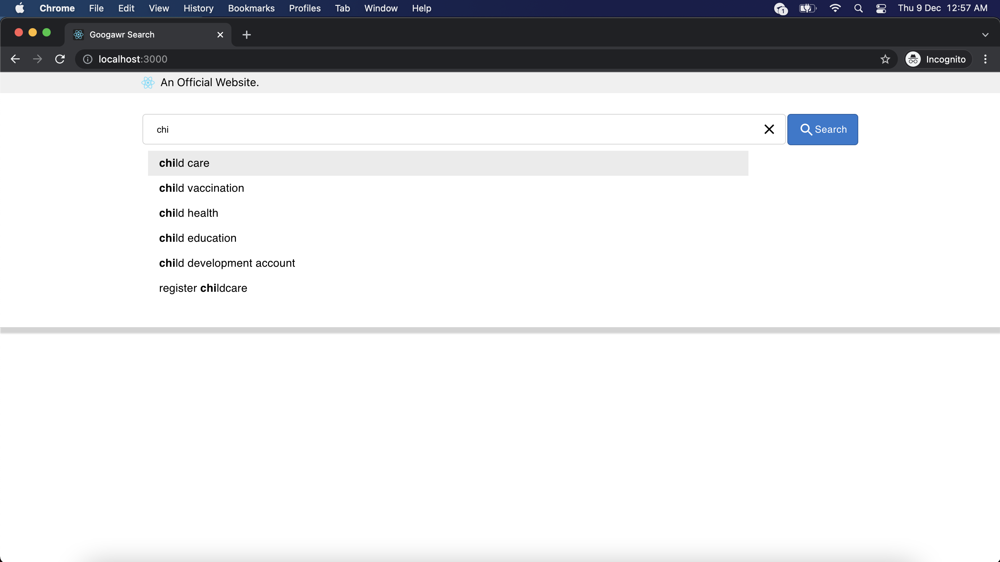
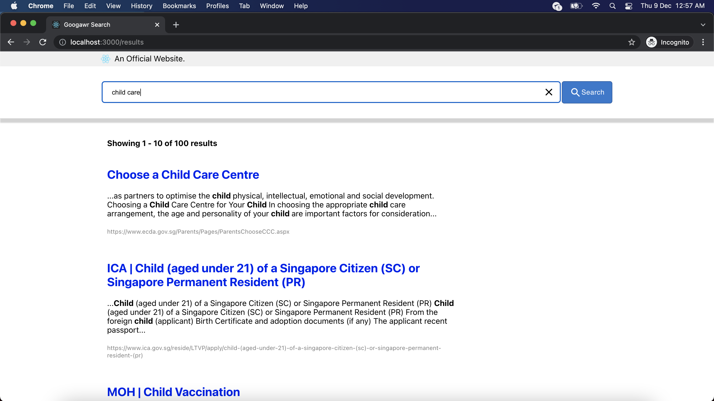

# googawr-search

Google Search like React Application built using `create-react-app`.

## Instructions

Run the following commands through the terminal:

To install:

```
1. git clone https://github.com/calvinyusno2359/googawr-search.git
2. cd googawr-search # or whatever directory name is used
3. npm install

# IMPORTANT: note you might see warnings like the following when npm install finishes:
58 vulnerabilities (47 moderate, 10 high, 1 critical)

You may try: npm audit, or npm audit --foce to fix it.
But from my machine, this cannot be fixed by npm audit.

This is a known issue with create-react-app. See:
https://github.com/facebook/create-react-app/issues/11174

On that note, the app should still run fine.
You may run: npm audit --production
This will show 0 vulnerabilities. As the vulnerability issues lie only with the tooling used in devDependencies, e.g. react-scripts, etc...
```

To run:

```
0. cd googawr-search # or whatever directory name is used
1. npm run
2. Open browser, nagivate to url: http://localhost:3000/

# you should see the screens like the preview below
```

To test:

```
# stop the running application first (if it is running), Ctrl + C should do

0. cd googawr-search # make sure terminal is at root of application
1. npm test
2. Press a; when it says `No tests found related to files changed since last commit.` to re-run all tests.
```

## Preview

1. Landing Page



2. Results Page


